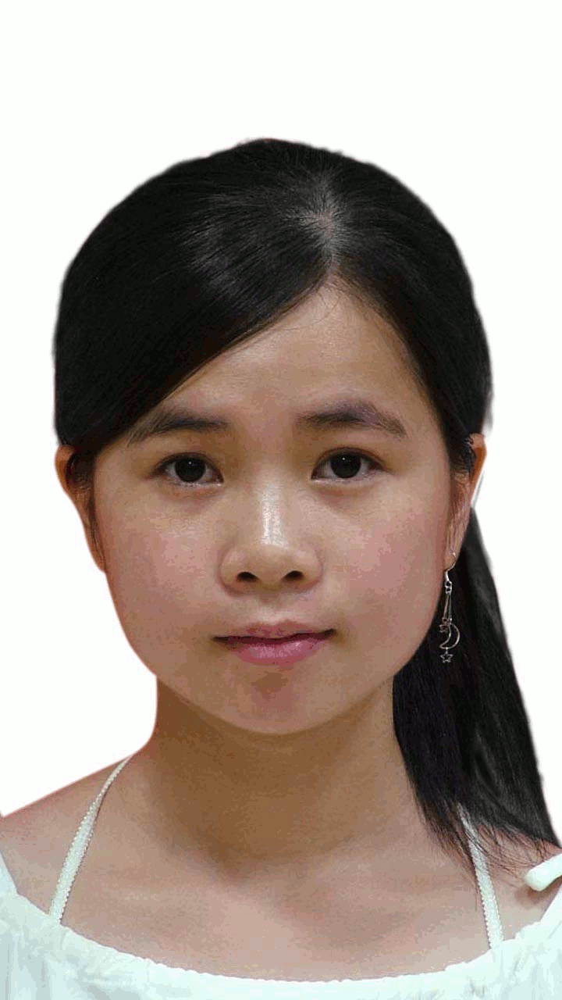
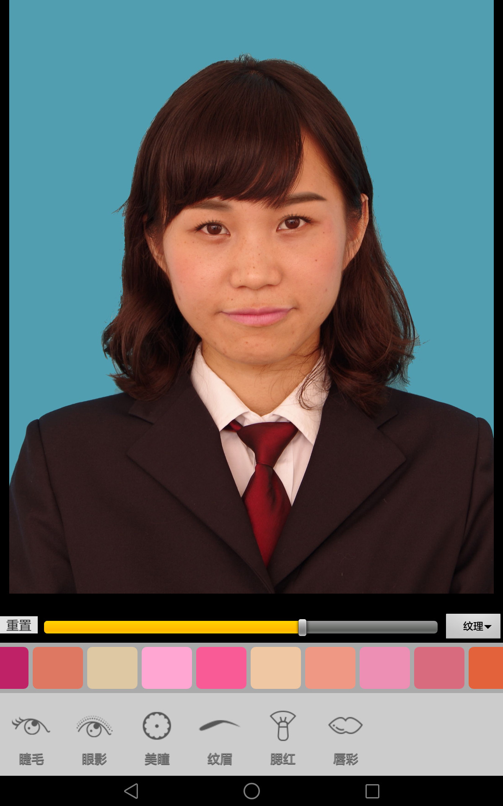

# PerfectShow

Welcome to PerfectShow, an image processing application for Android platform.

Up until now, I release functionalities about make-up.

Currently I use Eclipse project instead of Android Studio project, since the former IDE has a shallow directory hierarchy, and NDK building is easier to use.
This project mainly use OpenCV library for image processing, so you might as well have a good grasp of this field.

# Usage
1. Download Android OpenCV SDK from official site of [OpenCV](http://opencv.org/downloads.html), extract the archived package to somewhere *&lt;OpenCV-android-sdk&gt;*, then import the project under *&lt;OpenCV-android-sdk&gt;/sdk/java/* into Eclipse (Suppose you've got an Android development environment) and build it. For detailed steps, [this thread](http://docs.opencv.org/2.4/doc/tutorials/introduction/android_binary_package/dev_with_OCV_on_Android.html) walks you through how to do Android development with OpenCV.
2. Change the variable *OPENCV_ANDROID_SDK_HOME* in *jni/Android.mk* to the path *<OpenCV-android-sdk>* above, in our project, add a reference to the OpenCV Java SDK in Project -> Properties -> Android -> Library -> Add select OpenCV Library, then strike command to finish native code building, and last, build this Android project.
```sh
$ cd jni
$ ndk-build -j4
$ cd ..
$ ant debug
```

For Win32/Linux project, [cmake](https://cmake.org/download/) (CLI mode or GUI mode) is needed to generate native makefiles. Out-of-source build is recommended, as you can build multiple variants in separate directories. Compilers need to support some C++11 features, *Visual Studio* 2013 or newer works fine.
```sh
$ cd jni
$ mkdir build
$ cd build
$ cmake ..
$ make -j4
```


# Screenshot




# Contact
If you like this project, share your appreciation by following me in [GitHub](https://github.com/KAlO2).
If you have any problems about this project, you can file an issue [here](https://github.com/KAlO2/PerfectShow/issues) or join QQ group 571444731 for consulting.


# License
```
Copyright© 2016  Martin Taylor

Licensed under the Apache License, Version 2.0 (the "License");
you may not use this file except in compliance with the License.
You may obtain a copy of the License at

    http://www.apache.org/licenses/LICENSE-2.0

Unless required by applicable law or agreed to in writing, software
distributed under the License is distributed on an "AS IS" BASIS,
WITHOUT WARRANTIES OR CONDITIONS OF ANY KIND, either express or implied.
See the License for the specific language governing permissions and
limitations under the License.
```
